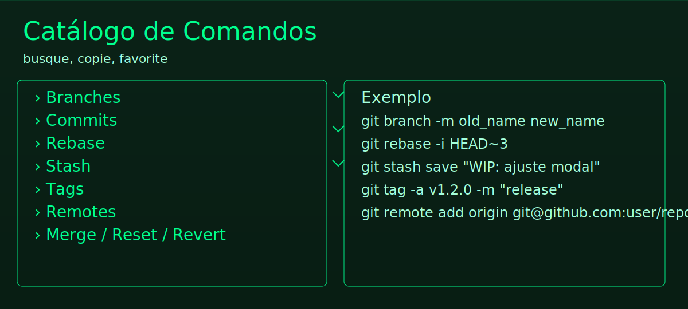
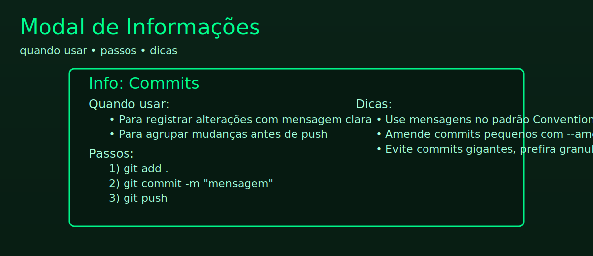

  

# GitHUB's HUB — remembering all commands

Um HUB retro no estilo Pip-Boy para dominar comandos do Git: catálogo organizado, exemplos práticos, cópia em um clique, criação de comandos customizados e um terminal próprio.

  
  
  
  
  
  

## Destaques
- Catálogo completo de comandos Git por categorias (branch, commit, rebase, stash, cherry-pick, tags, remotes, merge, reset, revert, log, diff, blame, etc.)
- Busca instantânea e cópia do comando em um clique
- Informações detalhadas por categoria (quando usar, passos e dicas) via modal de ajuda
- Criação de comandos customizados e favoritos
- Terminal retro integrado (Pip-Boy theme com glow, scanlines e CRT flicker)
- Empacotamento para Windows com ícone personalizado

## Sumário
- Instalação e Execução
- Modo Desktop (Electron)
- Empacotar para Windows
- Estrutura do Projeto
- Desenvolvimento
- Roadmap
- Contribuição e Licença

## Instalação e Execução
1) Pré‑requisitos
- Node.js 18+ e npm

2) Instalar dependências
- npm install

3) Rodar servidor de desenvolvimento
- npm run dev
- Abra http://localhost:5050/

Se precisar alterar a porta, execute no PowerShell:
- $env:PORT=5051; npm run dev

## Modo Desktop (Electron)
- npm run electron:dev
Inicia o app desktop usando o código do projeto.

## Empacotar para Windows
- npm run icon:gen  (opcional, atualiza o ícone)
- npm run pack:win   (gera executável em dist/)
Resultado esperado: dist/GitHUB's HUB-win32-x64/GitHUB's HUB.exe

## Estrutura do Projeto (resumo)
- server/: servidor Express + WebSocket
- public/: assets estáticos (incluindo banner.svg)
- electron/: bootstrap da aplicação Electron
- index.js: integração do servidor com o app
- package.json: scripts (dev, electron:dev, pack:win)

## Desenvolvimento
- Tema retro: verde fosforescente, glow, scanlines e chevrons
- Modal de informações com conteúdo dinâmico por categoria
- Ações rápidas: copiar, executar, favoritar, detalhes
- Páginas: Catálogo, Custom, Terminal, Favoritos, Ajustes, Ajuda

## Roadmap
- [x] Estrutura inicial do servidor Express + WebSocket
- [x] Catálogo base de comandos com cópia
- [x] UI temática retro
- [ ] Terminal conectado via WebSocket e node-pty
- [ ] Catálogo EXTENSO com exemplos detalhados
- [ ] Persistência de comandos customizados (localStorage)
- [ ] Sons e animações adicionais

## Demonstração

  

  
<strong>Exemplos por categoria (expandir)</strong>

  - Branches: `git branch -m old_name new_name`, `git switch -c feature/x`
  - Commits: `git commit -m "feat: add info modal"`, `git commit --amend`
  - Rebase: `git rebase -i HEAD~3`
  - Stash: `git stash save "WIP: ajustes"`, `git stash pop`
  - Tags: `git tag -a v1.2.0 -m "release"`
  - Remotes: `git remote add origin git@github.com:user/repo.git`

## Quickstart
- npm install
- npm run dev
- Abra http://localhost:5050/

## Troubleshooting
- Porta ocupada: use `$env:PORT=5051; npm run dev`
- Executável não abre: verifique se seu Windows permitiu execução (SmartScreen) e se o antivírus não bloqueou.
- Ícone do app não aparece: rode `npm run icon:gen` antes de `npm run pack:win`.
- Modal não aparece: confira se o botão de info está chamando a função de explicação e se não há erros no console.

## Badges de CI (futuro)
Quando houver GitHub Actions, podemos incluir:
- Build: 
- Tests: 
- Coverage: 

## Distribuição
- Executável Windows: dist/GitHUB's HUB-win32-x64/GitHUB's HUB.exe
- Instalador (opcional): `npm run build:win` (gera instalador via electron-builder)

## Demonstração (Modal)

  

## Why this project?
- Memória de comandos centralizada com visual divertido e funcional
- Ótimo para iniciantes e intermediários (explicações por categoria)
- Ferramentas de produtividade (favoritos, copiar, executar)

## Releases & Changelog
- Planejado: criar CHANGELOG.md com versões e notas
- Após builds, podemos publicar Releases no GitHub e linkar aqui

## Issues & PRs
- Reporte problemas via Issues
- Envie melhorias via Pull Requests

---

# English (short version)

## Highlights
- Complete Git commands catalog, fast search and one-click copy
- Info modal per category: when to use, steps, tips
- Custom commands, favorites, retro terminal (Pip-Boy theme)

## Quickstart
- npm install
- npm run dev
- Open http://localhost:5050/

## Packaging
- npm run pack:win → dist/GitHUB's HUB-win32-x64/GitHUB's HUB.exe

## Contribution
PRs are welcome. Check LICENSE.

---

## Contribuição e Licença
- Pull Requests são bem‑vindos.
- Consulte o arquivo LICENSE para detalhes.

Divirta‑se e que os commits estejam sempre a seu favor! 👾
